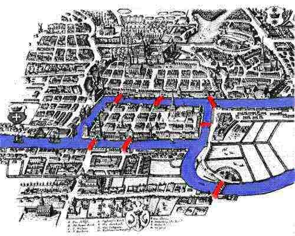
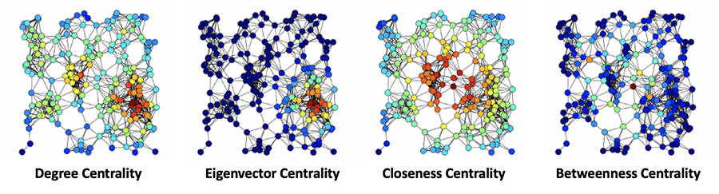
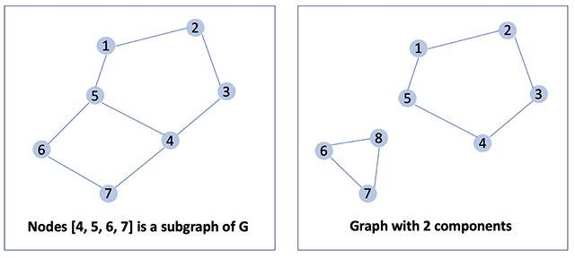

```{r setup, include=FALSE}
options(htmltools.dir.version = FALSE)
knitr::opts_chunk$set(echo = TRUE,   
                      message = FALSE,
                      warning = FALSE,
                      fig.height = 4,
                      fig.width = 8,
                      fig.align = "center")
```
background-image: url("img/bg.jpg")

---

background-image: url("img/flights.jpg")

---

background-image: url("img/k_map.jpg")

---
# Well - let's warm  up ...

In the center of the river, there lay 2 islands that were connected to each other and the river banks by 7 bridges.

Is there a route that would allow someone to cross all 7 bridges without crossing any of them more than once?


---
# Seven Bridges of Königsberg

Leonhard Euler:


*"... this type of solution bears little relationship to mathematics, and I do not understand why you expect a mathematician to produce it..."*

... and then ...

*"...This question is so banal, but seemed to me worthy of attention in that [neither] geometry, nor algebra, nor even the art of counting was sufficient to solve it."*

## **... NO SOLUTION!!!!**

and then... in 1875, the people of Königsberg decided to build a new bridge...

---
# Why Network Science?

If you have any of these questions:

- What are the elements in the system?

- What are the role of those elements in the system?

- What are the processes/interactions that build systems?

- What are the dynamics of changes in the system?(e.g. spread of the disease, etc.)

---
# Why Network Science?

understanding how people, entities, structures are connected

how ... interact

how ... that influence the change in ... across space and time

### **Overall**: use network analysis if you need to understand the **system**: 
  
  = how **interactions** or **connections** between **components** make up a **system**
---
# Applications 

social networks - any!

- humans and animals

- ecological communities and populations

- personality traits

- biological systems: genes regulation systems, metabolic systems

- ANY SYSTEM 


---
# LinkedIn


### What is this?
---
# LinkedIn


### a collection of vertices, V, and edges, E.
---
# Key concepts:


A **graph** is a number of points that are connected by lines. 

Each point is usually called a **vertex** = node (more than one are called **vertices** = nodes)

Lines are called **edges**.
---
# Key concepts:


**Incident**: Any edge is incident to 2 vertices.

x is incident to A and E. 
---
# Key concepts:


**Adjacent**: Adjacent vertices are connected by an edge.

G is adjacent to D, F, and H because there is some edge going from G to all these other vertices. 
---
# Key concepts:


**Isolated**: B is isolated because it’s not connected to any other vertices

---
# Key concepts:


**Degree**: The degree is just the number of connections a vertex has

A has a degree of 2, B has a degree of 0, and F has a degree of 4. 

---
# Key concepts:


---
# Key concepts:


**Weight**: a value representing the length of the edge.
---
class: center, middle

# Ways to represent graphs

### non-linear data structure (the visual representation) -> linear data structure ???

---
# Edge lists


unordered list of edges


Practical, but not efficient for really dense graphs 
???

Image credit: [Vaidehi Joshi](https://medium.com/basecs/from-theory-to-practice-representing-graphs-cfd782c5be38)

---
# Adjacency lists


**Adjacency lists**: lists out the connections for each vertex

An **adjacency matrix** is a matrix representation of exactly which nodes in a graph contain edges between them

???
Image credit: [Vaidehi Joshi](https://medium.com/basecs/from-theory-to-practice-representing-graphs-cfd782c5be38)
---

# Example


---

# Questions to ask about a network:

- How large the network is?

- How densely connected is it? 

- Is the network made up of one or more distinct groups?

- How compact is the network?

- How clustered are the network members?

---
# Measures

## Graph measures

## Node measures

## Edge measures

## Network measure

---

# Network of connections between devices within the Internet


???
Image credit: [Network of connections between devices within the Internet. Courtesy of Steve Jurvetson](http://www.flickr.com/photos/jurvetson/916142/)

---

# Graph measures

## **Size**

= the number of members (e.g nodes, vertices or actors)

Some books may refer to the number of nodes, while the number of edges is less common.

---

# Graph measures

##  **Density** 

proportion of observed ties in a network to the maximum number of possible ties.

a ratio that can range from 0 to 1.

more interconnected networks have density closer to 1.

---
# Graph measures

##  **Density** 

Density of directed network:

(directed network is a network with a direction)

Number of observed ties `L` to the maximum number of possible ties among `k` actors `k ∗ (k−1)`, so the formula for density is:

### `density= L/(k*k-1))

Loops are excluded! (= a tie between a node and itself)

Density of undirected network

where L is the number of observed ties in the network.

##  **Diameter**

The maximum of the shortest distances between all node-pairs in the graph.
---

# Node Measure 

##**Centrality**

"Which node is the most important one in the network?" 

- a function that assigns a numerical value to each vertex of a network according to its influence on the others. 

- the importance of a node is determined by its position within a network. 

- the meaning depends on the type of the network (e.g effective person in a social network or key train station in the urban networks).

---

# Node Measure

## **Centrality**

Centrality can be classified in *local* and *global*

---
# Node Measure - **Centrality**

## Local Centrality Measures

**Degree Centrality**: Number of edges that a node has 
= the number of links incident upon a node.

---

# Node Measure

**Eigencentrality** is a measure of the importance of a node in a network. 

- assigns relative scores to all nodes in the network that connections to high-scoring nodes contribute more to the score of the node in question than equal connections to low-scoring nodes.

Node high on eigenvector centrality is essentially connected to many high degree nodes.

---

# Node Measure

##  **Closeness Centrality** 

In a connected graph, the **normalized closeness** of a node is the average length of the shortest path between the node and all other nodes in the graph. 

The more central a node is, the closer it is to all other nodes.

---

# Node Measure

##  **Betweenness Centrality** 

The **normalized betweenness** of a node is the number of times a node acts as a bridge along the shortest path between two other nodes.

---

# Node Measure



---

# Network Measure

## **Subgraphs**: 

Subset of nodes in a network, along with all of the edges linking these nodes.

## **Components** 

A subgraph of the network that is disconnected from each other.

---

# Network Measure

## **Subgraphs** and **Components** 


---

# Why R?

- free, cross-platform, open-source programming language

- large community of users and large community of academic users

- dynamic growth with new and improved packages

- Comprehensive R Archive Network (CRAN): repository with R packages that have been vetted and deposited on a server

---

# Packages to use

[igraph](https://igraph.org/r/)

[statnet](https://cran.r-project.org/web/packages/statnet/)

[`ggraph`](https://cran.r-project.org/web/packages/ggraph/)

[`tidygraph`] (https://cran.r-project.org/web/packages/tidygraph/) 

```{r eval=FALSE}
#install.packages("igraph","statnet", "ggraph", "tidygraph")

#load libraries
library (igraph)
library (statnet)
library(ggraph)
library(tidygraph)
```

---

# Big task:

(apart from conquering the universe)

complete a small project in R using social network analysis, using the provided dataset

# Smaller tasks:

- see each topic!

---

# R Packages

This tutorial we will use:

- `igraph`

- `statnet`

Also
- `tidygraph`

- `ggraph` 

Let's talk about them briefly to dig into more details in the practical part.

---

#`igraph` package

['igraph'](https://igraph.org/) is a collection for creating and manipulating graphs and analyzing networks. 

- written in C and also exists as Python and R packages.

- [`igraph` package](https://igraph.org/r/)

---

#`statnet` package

['statnet'](http://statnet.org/) is a collection of R packages for 

- management, 

- exploration, 

- statistical analysis, 

- simulation and 

- vizualization of network data. 

- based on [Exponential-family Random Graph Models (ERGMs)](https://en.wikipedia.org/wiki/Exponential_random_graph_models).  

---

#`ggraph`

[`ggraph`](https://cran.r-project.org/web/packages/ggraph/) is an extension of `ggplot2` for graph visualizations

- use the same layer by layer philosophy

---

# `tidygraph`

[`tidygraph`] (https://cran.r-project.org/web/packages/tidygraph/) is a tidy API for graph manipulation

- Provides a way for dplyr to interact with graphs

---

# Datasets

[`networkdata` package](http://networkrepository.com/): a large collection of dataset for network science from wide variety of areas

```{r eval=FALSE}
install.packages("remotes")
remotes::install_github("schochastics/networkdata")
library(networkdata)

```

```{r eval=FALSE}

#to see the list of datasets
data(package = "networkdata")
```

---

# Network Data objects

Types of information:

**Nodes**: list of nodes in network + node labels (Required)

in `statnet` =vertices

**Ties**: list of ties in the network (Required)

**Node attributes**: attributes of the nodes (Optional)

**Tie attributes**: attributes of the ties (Optional)

**Metadata**: other information about the entire network
`statnet` = global information about the network (e.g. directed or not directed, are loops allowed, etc.)

---
