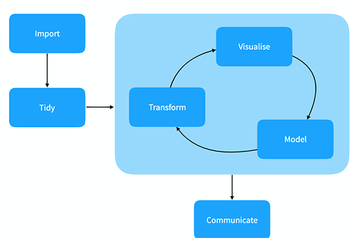
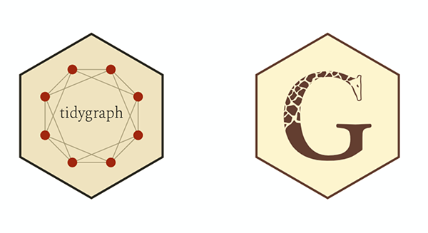
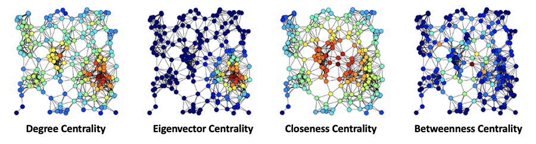
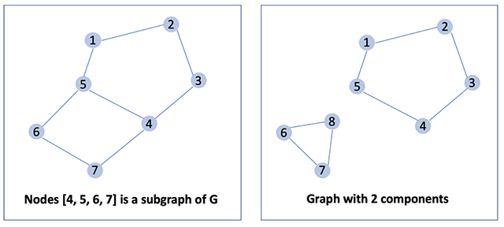

background-image: 

```{r setup, include=FALSE}
options(htmltools.dir.version = FALSE)
knitr::opts_chunk$set(echo = TRUE,   
                      message = FALSE,
                      warning = FALSE,
                      fig.height = 4,
                      fig.width = 8,
                      fig.align = "center")
library(tidyverse)
```

???

Image credit: [Wikimedia Commons](https://commons.wikimedia.org/wiki/File:Sharingan_triple.svg)

---

# Visualization and wrangling:`ggraph` and `tidygraph`

[`ggraph`](https://cran.r-project.org/web/packages/ggraph/)

[`tidygraph`](https://cran.r-project.org/web/packages/tidygraph/) 

```{r eval=FALSE}
#install.packages("igraph","statnet", "ggraph", "tidygraph")

#load libraries
library(ggraph)
library(tidygraph)
```

---
#Tidy data workflow - R


---
# `ggraph` and `tidygraph`



---
#Short case:

```{r}
# Load Packages 
library(ggraph)
library(igraph) 
library(tidyverse)
```

Dataset: [Kaggle dataset](https://www.kaggle.com/prashant111/the-simpsons-dataset?select=simpsons_script_lines.csv)

---
#Data Preparation

```{r}
# Load scripts and remove non-speaking lines
lines <- read_csv("simpsons_script_lines.csv")

speaking_lines <- lines %>% 
  filter(!is.na(raw_character_text))

# Limit analysis to re-occuring characters in 20 or more episodes
top_char <- speaking_lines %>% 
  group_by(raw_character_text) %>% 
  mutate(appearances=n_distinct(episode_id)) %>% 
  filter(appearances >= 20) %>%
  ungroup()

# Count characters lines per episode 
lines_per_ep <- top_char %>% 
  group_by(raw_character_text, episode_id) %>% 
  summarise(lines=n()) %>% 
  ungroup()

#write_csv(lines_per_ep, "lines_per_ep.csv")
#load the prepared dataset
#lines_per_ep <-read_csv("https://raw.github.com/maria-pro/dataset//main/lines_per_ep.csv")
```
---
# Adjacency matrix

Let's convert the dataset into a weighted N∗N adjacency matrix of character connections. 

Count characters’ lines per episode, then use cosine similarity to weigh connections based on episodes appearances and amount of dialogue.


```{r}
# Convert to matrix
char_df <- lines_per_ep %>% 
  spread(episode_id, lines, fill=0)

char_mat <- as.matrix(select(char_df, -raw_character_text))
rownames(char_mat) <- char_df$raw_character_text

# Calculate cosine distance between characters
cosine_sim <- as.dist(char_mat %*% t(char_mat) / (sqrt(rowSums(char_mat^2) %*% t(rowSums(char_mat^2)))))
```
---

# Initial look at the network 
```{r}
autograph(as.matrix(cosine_sim))

```
---
# igraph network

Remove weaker connections from the adjacency matrix and introduce igraph functions for layout and community detection.

Let's use the Louvain Method to create small clusters optimising locally, then iteratively build a network using smaller clusters as nodes.

```{r}
# Filter weak connections. The amount chosen here is arbitrary. Try different variations. 
cs_strong <- cosine_sim
cs_strong[cs_strong < max(cs_strong) * 0.25] <- 0 

# Create an igraph object 
ig <- as.matrix(cs_strong) %>% 
  graph_from_adjacency_matrix(mode = "undirected", weighted = TRUE)

# Community detection algoritm 
community <- cluster_louvain(ig) 

# Attach communities to relevant vertices
V(ig)$color <- community$membership 
```

---
#Plotting

```{r}
# Graph layout
layout <- layout.random(ig) 

# igraph plot 
plot(ig, layout = layout)
```

---
#`ggraph`

Let's customise further!

`ggraph` allows adjustments to be added layer by layer. 

Layers to control network attributes include:

`geom_edge_link()`: Straight line edge connections between nodes
`geom_node_point()`: Vertex markers
`geom_node_text()`: Vertex labels

Finally, add theme or labels carry over from `ggplot2`
---
#`ggraph`

```{r}
# Plot with same aesthetic adjustments as previous
ggraph(ig, layout = "fr") +
  geom_edge_link() + 
  geom_node_point(aes(color = factor(color))) + 
  geom_node_text(aes(label = name), repel = TRUE) +
  theme_void() +
  theme(legend.position = "none") 
```
---
# Adjusting aesthetics and layout

Replace `geom_edge_link()` with `geom_edge_fan()` to avoid overlapping and reduce the boldness of edges.

For the vertices: Use `aes()` to link size and text with degree centrality. 

Use the `degree()` function to calculate the importance of vertices by their number of connections.

Use layout = "fr" to use Fruchterman-Reingold, one of the most widely used algorithms. It is a force-directed method which attempts to avoid edges crossing or differing significantly in length.

---

```{r}
# Set size to degree centrality 
V(ig)$size = degree(ig)

# Additional customisation for better legibility 
ggraph(ig, layout = "fr") +
  geom_edge_arc(strength = 0.2, width = 0.5, alpha = 0.15) + 
  geom_node_point(aes(size = size, color = factor(color))) + 
  geom_node_text(aes(label = name, size = size), repel = TRUE) +
  theme_void() +
  theme(legend.position = "none") 
```
---
# Layout options

No best layout as different algorithms have their strengths and purposes!

```{r}
#install.packages("gridExtra")
library(gridExtra)

# Test different layouts 
g1 <- ggraph(ig, layout = "mds") +
  geom_edge_arc(strength=0.2, width=0.5, alpha=.15) + 
  geom_node_point(aes(size=size, color=factor(color))) + 
  theme_void() +
  theme(legend.position = "none") + 
  labs(title = "Multi-Dimensional Scaling")
```

---

```{r}
g2 <- ggraph(ig, layout = "kk") +
  geom_edge_arc(strength=0.2, width=0.5, alpha=.15) + 
  geom_node_point(aes(size=size, color=factor(color))) + 
  theme_void() +
  theme(legend.position = "none") + 
  labs(title = "Kamada-Kawai")

```
---


```{r}

g3 <- ggraph(ig, layout = "lgl") +
  geom_edge_arc(strength=0.2, width=0.5, alpha=.15) + 
  geom_node_point(aes(size=size, color=factor(color))) + 
  theme_void() +
  theme(legend.position = "none") + 
  labs(title = "Large Graph Layout") 

```
---
```{r}
g4 <- ggraph(ig, layout = "graphopt") +
  geom_edge_arc(strength=0.2, width=0.5, alpha=.15) + 
  geom_node_point(aes(size=size, color=factor(color))) + 
  theme_void() +
  theme(legend.position = "none") + 
  labs(title = "GraphOPT")


```
---
#Filtering

Let's do filtering within the `aesthetic` mapping to highlight areas of interest:

- chart filters vertex size to remove color and labels from less important characters

- shows how the colors can be set directly

---


```{r}
# Filter example
cs_weak <- cosine_sim
cs_weak[cs_weak < max(cs_weak) * 0.1] <- 0 

ig2 <- graph.adjacency(as.matrix(cs_weak), weighted = TRUE, mode = "undirected")
V(ig2)$size <- degree(ig2) 

community2 <- cluster_louvain(ig2)
V(ig2)$color <- community2$membership

g5 <- ggraph(ig2, layout = "graphopt") +
  geom_edge_link(alpha = 0.15) + 
  geom_node_point(aes(filter = size <= 50, size = size, alpha = 0.5)) + 
  geom_node_point(aes(filter = size > 50, size = size, color = factor(color))) + 
  geom_node_text(aes(filter = size > 50, label = name, size = size), repel = TRUE) +
  theme_void() +
  theme(legend.position = "none") +
  labs(title = "Degree Centrality")
```
---

```{r}
# Change colors for Simpsons Family 
ig_simp <- ig 
V(ig_simp)$color <- "grey20"
V(ig_simp)$color[grepl("Simpson", V(ig_simp)$name)] <- "gold"

g6 <- ggraph(ig_simp, layout = "fr") +
  geom_edge_link(alpha = 0.15) + 
  geom_node_point(aes(size = size), color = V(ig_simp)$color) + 
  geom_node_text(aes(filter = grepl("Simpson", name), size = size, label = name), repel=TRUE) +
  theme_void() +
  theme(legend.position = "none") + 
  labs(title = "Simpson Family")

```
---
# Graph measures

**Size**: the number of members (e.g nodes, vertices or actors)

Some books may refer to the number of nodes, while the number of edges is less common.

**Density**: proportion of observed ties in a network to the maximum number of possible ties (a range from 0 to 1).

- more interconnected networks have density closer to 1.

**Diameter**: The maximum of the shortest distances between all node-pairs in the graph.

---

# Node Measure 

**Centrality**: "Which node is the most important one in the network?" 

- a function that assigns a numerical value to each vertex of a network according to its influence on the others. 

- the importance of a node is determined by its position within a network. 

- the meaning depends on the type of the network (e.g effective person in a social network or key train station in the urban networks).

---

# Node Measure 

**Degree Centrality**: Number of edges that a node has 
= the number of links incident upon a node.

**Eigencentrality** is a measure of the importance of a node in a network. 

- assigns relative scores to all nodes in the network that connections to high-scoring nodes contribute more to the score of the node in question than equal connections to low-scoring nodes.

Node high on eigenvector centrality is essentially connected to many high degree nodes.
---

# Node Measure



---

# Node Measure

**Closeness Centrality**: the average length of the shortest path between the node and all other nodes in the graph.

The more central a node is, the closer it is to all other nodes.

**Betweenness Centrality**: the number of times a node acts as a bridge along the shortest path between two other nodes.

Different types of centrality measures to determine the most influential nodes of a network

BUT

no consensus on how to select and implement the best tailored measure for a given network.

More than 140 benchmarks currently available to identify the central vertices, but which one should be used to calculate the influential nodes?
---
# CINNA (Central Informative Nodes in Network Analysis) 

an R package for computing, analyzing and comparing centrality measures submitted to CRAN repository.


```{r}
#install.packages("CINNA")
library(CINNA)
data("zachary")

plot(zachary)
```

---

# CINNA (Central Informative Nodes in Network Analysis) 

calculate centrality types based on the graph structure with the `proper_centralities()` 

- a list with 43 popular centrality names specific for an undirected-unweighted structure. 

```{r message=FALSE}
pr_cent<-proper_centralities(zachary)
```
E.g. choose the first five centrality measures on the list and use them in `calculate_centralities()` function

- use the Principal Component Analysis (PCA) algorithm to distinguish the most informative centrality measure: each centrality measure as a variable

** PCA is a dimensional reduction technique respectively for linear analysis.

Centralities which are correlated with the principal components are the most important in identifying the central nodes. 

Use the contribution criterion from the PCA shows how variables contribute to the principal components.
---

# CINNA (Central Informative Nodes in Network Analysis) 

To detect which centralities have more information about the central nodes -> which one can describe influential vertices of a network more accurately.

```{r}
calculate_centralities(zachary, include = pr_cent[1:5])%>%
  pca_centralities(scale.unit = TRUE)

```

*Barycenter Centrality* has the most contribution value among the five centrality indices.
---

# CINNA (Central Informative Nodes in Network Analysis) 

A representation of the graph in which each nodes size indicates its corresponding centrality value, would be like below.

```{r}
visualize_graph( zachary , centrality.type="Barycenter Centrality")

```

---
# Network Measure

**Subgraphs**: Subset of nodes in a network, along with all of the edges linking these nodes.

**Components**: A subgraph of the network that is disconnected from each other.



---
# Network Measure

**Homophily**: the tendency of nodes to connect to others who are similar on some variable.

**Community detection**: a number of algorithms to detect groups that consist of densely connected nodes with fewer connections across groups.

Community detection based on **edge betweenness (Newman-Girvan)**: high-betweenness edges are removed sequentially (recalculating at each step) and the best partitioning of the network is selected.

---
# `tidygraph` package

- provides a tidy framework to easily manipulate different types of relational data, including: graph, network and trees.

Network data are considered as two tidy data tables:

- data table 1: *node data* and 

- - data table 2: *edge data*. 

The package provides a simple solution to switch between the two tables and provides `dplyr` verbs for manipulating them.

---
#Create network objects

```{r}
library(tidyverse)
library(tidygraph)
library(ggraph)

#devtools::install_github("kassambara/navdata")
library(navdata)
```

`tbl_graph()`: Creates a network object from nodes and edges data

`as_tbl_graph()`: Converts network data and objects to a tbl_graph network.

Dataset: phone.call2 data (`navdata` package) include a list with the nodes and the edges list.

---
#Create network objects

Create a tbl_graph network object using the phone call data:

```{r}
data("phone.call2")
phone.net <- tbl_graph(
  nodes = phone.call2$nodes, 
  edges = phone.call2$edges,
  directed = TRUE
  )

```
  
---
#Create network objects

```{r}
ggraph(phone.net, layout = "graphopt") + 
  geom_edge_link(width = 1, colour = "lightgray") +
  geom_node_point(size = 4, colour = "#00AFBB") +
  geom_node_text(aes(label = label), repel = TRUE)+
  theme_graph()

```
---
# Short example with `mtcars`

- Use the `mtcars` dataset

- Compute the correlation matrix: `correlate()`

- Convert the upper triangle to NA: `shave()`

- Stretch the correlation data frame into long format

- Keep only high correlation

```{r}
#install.packages(""corrr")
library(corrr)
res.cor <- mtcars [, c(1, 3:6)] %>%  # (1)
  t() %>% correlate() %>%            # (2)
  shave(upper = TRUE) %>%            # (3)
  stretch(na.rm = TRUE) %>%          # (4)
  filter(r >= 0.998)                 # (5)
# res.cor
```
---

#Create the correlation network graph:

```{r}
set.seed(1)
cor.graph <- as_tbl_graph(res.cor, directed = FALSE)
ggraph(cor.graph) + 
  geom_edge_link() + 
  geom_node_point() +
  geom_node_text(
    aes(label = name), size = 3, repel = TRUE
    ) +
  theme_graph()
```
---
# Print out a network object

```{r}
cor.graph

```
---
#Active tibble

The notion of an `active tibble` within a `tbl_graph` object makes it possible to manipulate the data in one tibble at a time. 

The `nodes` tibble is activated by default, but you can change which tibble is active with the `activate()` function.

E.g. to rearrange the rows in the `edges` tibble to list those with the highest “r” first,  use `activate()` and then `arrange()`.

```{r}
cor.graph %>% 
  activate(edges) %>% 
  arrange(desc(r))
```

---
# Network graph manipulation

`as_tibble(cor.graph)` converts the object back to tibble

`tidygraph` package allows to manipulate the nodes and the edges data in the network graph object using `dplyr` verbs: filter/arrange, add/rename columns, etc.

Let's modify the nodes data and edges data.

---
# Modifying nodes data

- Group the cars by the “cyl” variable (number of cylinders) in the original mtcars data set. 

- Join the group info to the nodes data

- Rename the column “name”, in the nodes data, to “label”

```{r}
# Car groups info
cars.group <- data_frame(
  name = rownames(mtcars),
  cyl = as.factor(mtcars$cyl)
)

# Modify the nodes data
cor.graph <- cor.graph %>%
  activate(nodes) %>%
  left_join(cars.group, by = "name") %>%
  rename(label = name)
```
---
# Modifying the edge data. 

Rename the column “r” to “weight”.

```{r}
cor.graph <- cor.graph %>%
  activate(edges) %>%
  rename(weight = r)
```

---

```{r}
cor.graph
```

---
# Visualizing the correlation network

- Change the edges width according to the variable weight

- Scale the edges width by setting the minimum width to 0.2 and the maximum to 1.

- Change the color of cars (nodes) according to the grouping variable cyl.
---
# Visualizing the correlation network

```{r}
ggraph(cor.graph) + 
  geom_edge_link(aes(width = weight), alpha = 0.2) + 
  scale_edge_width(range = c(0.2, 1)) +
  geom_node_point(aes(color = cyl), size = 2) +
  geom_node_text(aes(label = label), size = 3, repel = TRUE) +
  theme_graph()
```
---
# Network analysis

How **central** (= important) is a node or edge in the network?

The `tidygraph` package contains more than 10 centrality measures:


```{r eval=FALSE}
centrality_authority()
centrality_betweenness()
centrality_closeness()
centrality_hub()
centrality_pagerank()
centrality_eigen()
centrality_edge_betweenness()
```
---

# Network analysis

```{r}
phone.net %>%
  activate(nodes) %>%
  mutate(centrality = centrality_authority()) %>% 
  ggraph(layout = "graphopt") + 
  geom_edge_link(width = 1, colour = "lightgray") +
  geom_node_point(aes(size = centrality, colour = centrality)) +
  geom_node_text(aes(label = label), repel = TRUE)+
  scale_color_gradient(low = "yellow", high = "red")+
  theme_graph()
```
---

# Clustering

a common operation in network analysis aimed at grouping nodes based on the graph topology (= community detection based on its commonality in social network analysis).

Many clustering algorithms from are available in the `tidygraph` package:

`group_infomap()`:  Infomap community finding. It groups nodes by minimizing the expected description length of a random walker trajectory. 

`group_edge_betweenness()`: Community structure detection based on edge betweenness. It groups densely connected nodes. 

---
# Clustering

```{r}

cor.graph %>%
  activate(nodes) %>%
   mutate(community = as.factor(group_infomap())) %>% 
  ggraph(layout = "graphopt") + 
  geom_edge_link(width = 1, colour = "lightgray") +
  geom_node_point(aes(colour = community), size = 4) +
  geom_node_text(aes(label = label), repel = TRUE)+
  theme_graph()
```
